# Procesverslag
Markdown is een simpele manier om HTML te schrijven.  
Markdown cheat cheet: [Hulp bij het schrijven van Markdown](https://github.com/adam-p/markdown-here/wiki/Markdown-Cheatsheet).

Nb. De standaardstructuur en de spartaanse opmaak van de README.md zijn helemaal prima. Het gaat om de inhoud van je procesverslag. Besteedt de tijd voor pracht en praal aan je website.

Nb. Door *open* toe te voegen aan een *details* element kun je deze standaard open zetten. Fijn om dat steeds voor de relevante stuk(ken) te doen.

## Jij

  
uitwerken voor kick-off werkgroep

  ### Auteur:
  Sanne Romijn
  #### Je startniveau:
  Blauw
  #### Je focus:
  Surface laag
 

## Je website

  
uitwerken voor kick-off werkgroep

  ### Je opdracht:
  link naar de website die je gaat namaken óf de naam/omschrijving van je eigen ontwerp
Rituals - https://www.rituals.com/nl-nl/home 

  #### Screenshot(s) van de eerste pagina (small screen): 
Homepage - https://www.rituals.com/nl-nl/home 
  

  #### Screenshot(s) van de tweede pagina (small screen):
  hier de naam van de pagina  
  

  
 

## Toegankelijkheidstest 1/2 (week 1)

  
uitwerken na test in 2e werkgroep

  ### Bevindingen
  Lijst met je bevindingen die in de test naar voren kwamen:
De site geeft veel foutmeldingen. De headers staan niet op volgorde. De h1 is niet de titel van de pagina. Het filmpje kan niet op pauze. Niet alles had een alt tekst. De button elementen waren niet goed gebruikt. Dark mode is niet supported. 

## Breakdownschets (week 1)

  
uitwerken na afloop 3e werkgroep

  ### de hele pagina: 
  
  

  ### dynamisch deel (bijv menu): 
  

  ### wellicht nog een dynamisch deel (bijv filter): 
  

## Voortgang 1 (week 2)

  
uitwerken voor 1e voortgang

  ### Stand van zaken
  hier dit ging goed & dit was lastig (neem ook screenshots op van delen van je website en code)

  Het schrijven van de HTML ging goed. Ik heb sommige dingen anders gedaan dan dat mijn website het heeft gedaan. Ik vind het nog wel lastig om alles een goede naam te geven zoals sections en articles en hoe sommige dingen goed genest moeten worden. 

  ### Agenda voor meeting
  samen met je groepje opstellen

  | student 1      | student 2          | student 3    | student 4        |
  | Maeren         | Bente              | Jamie        | Sanne            |
  | Aantal kleine  | Toegankelijkehid   | HTML         | HTML             |
  | vraagjes       | formaat foto's     |              |                  |
  | HTML           | HTML               |              |                  |

  ### Verslag van meeting
  hier na afloop snel de uitkomsten van de meeting vastleggen

Ik loop nog best wel achter en ik ga goed meedoen met de opdrachten zodat ik de stof beter ga begrijpen. 

## Voortgang 2 (week 3)

  
uitwerken voor 2e voortgang

  ### Stand van zaken
 Ik heb meer gewerkt aan de opdrachten en tot nu toe heeft dat best wel geholpen. 
  
    
      

  ### Agenda voor meeting
  samen met je groepje opstellen

  | Fleur          | Kenza              | Bregtje      | Sanne            |
  |                |                    |              |                  |
  | Hamburgermenu  | geen vragen        | geen vragen  | geen vragen      |
  |                |                    |              |                  |
  |                |                    |              |                  |

  ### Verslag van meeting
  hier na afloop snel de uitkomsten van de meeting vastleggen

De headinglevels die ik heb gebruikt moet ik even fixen zodat ik een goede volgorde heb.

## Toegankelijkheidstest 2/2 (week 4)

  
uitwerken na test in 9e werkgroep

  
    
      
        
          

  ### Bevindingen
  Lijst met je bevindingen die in de test naar voren kwamen (geef ook aan wat er verbeterd is):

  Ik heb de headers op volgorde gezet. Ik heb ervoor gezorgd dat de h1 de titel van de pagina is. Ik heb een filmpje dat op pauze kan. Ik heb overal een alt tekst bijgezet. Ik heb buttons gebruikt voor elementen die niet doorverwijzen naar een andere pagina, daar heb ik a's voor gebruikt. Ik heb ook een dark mode toegevoegd. het is me nog niet gelukt dat de screenreader het hamburgermenu opent. 

## Voortgang 3 (week 4)

  
uitwerken voor 3e voortgang

  ### Stand van zaken
  hier dit ging goed & dit was lastig (neem ook screenshots op van delen van je website en code)

  Ik heb problemen met Github. Ik loop ook best wel achter. Ik vind het best lastig en het duurt lang totdat ik het heb staan zoals ik in gedachten had. Ik heb nog geen tweede pagina en de eerste is nog niet helemaal af. Ook heb ik nog geen dingen van surface plane. 

  ### Agenda voor meeting
  samen met je groepje opstellen

  | Jamie          | Bente              | Tim          | Sanne            |
  |                |                    |              |                  |
  | formulier      | footer             | responsive   | H1 img           |
  |                | responsive         | check        | Github           |
  |                | javascript         | focus state  |                  |

  ### Verslag van meeting
  hier na afloop snel de uitkomsten van de meeting vastleggen

Ik moet even een nieuwe repository aanmaken en hopelijk werkt Github dan weer dus dat ga ik zo snel mogelijk doen. Ik moet nog hard werken om de deadline te halen maar ik denk wel dat het gaat lukken. 

## Eindgesprek (week 5)

  
uitwerken voor eindgesprek

  ### Je uitkomst - karakteristiek screenshots:
  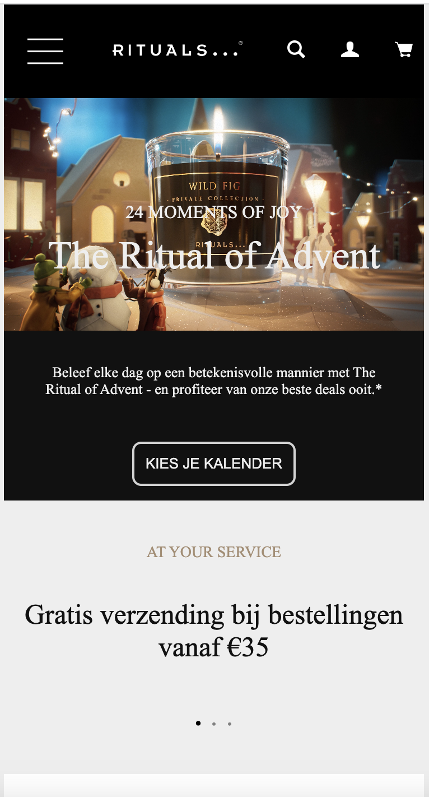
    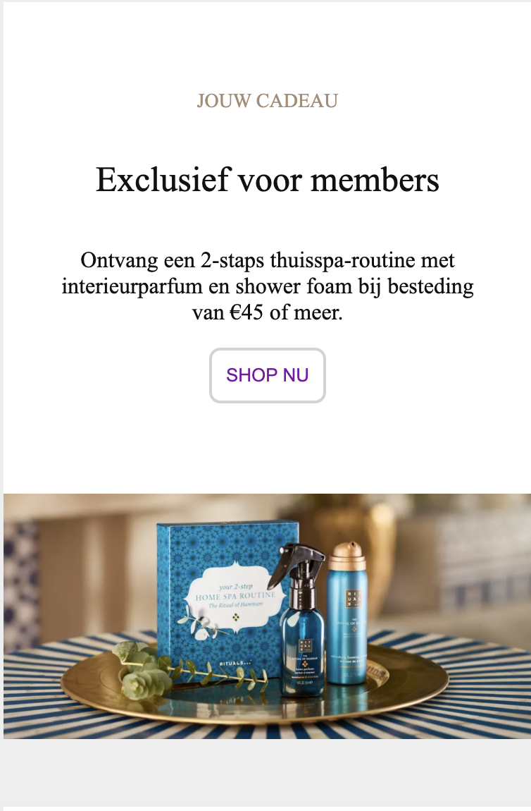
      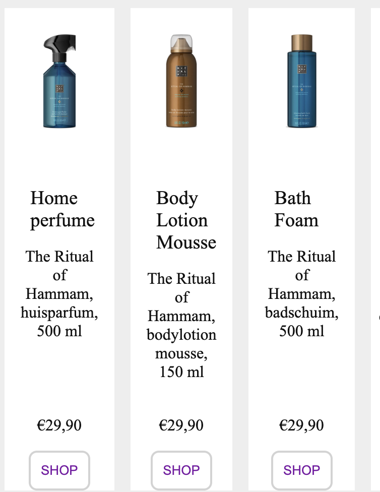
        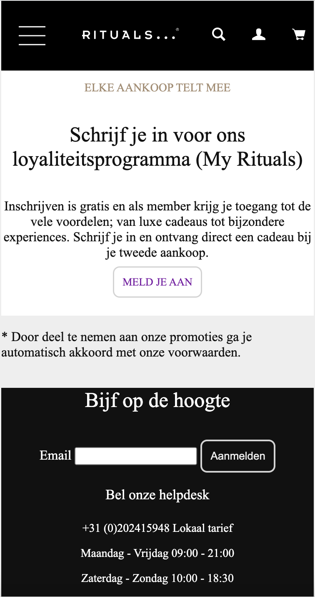
          
            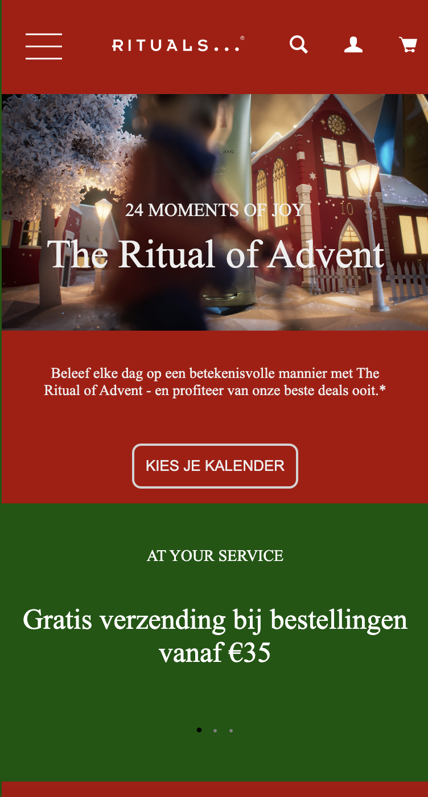

  ### Dit ging goed/Heb ik geleerd: 
  Korte omschrijving met plaatjes

Ik heb geleerd om de kleuren op te slaan als variabelen in de root en deze aan te passen voor bijvoorbeeld een darkmodus. 
  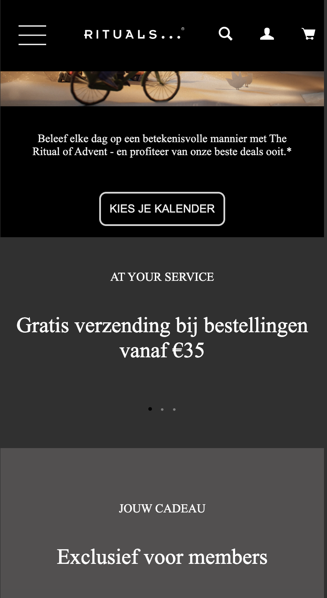

  ik heb geleerd om overflow te gebruiken om horizontaal te scrollen
  

Ik heb geleerd om met java script micro acties te maken. Hier heb ik een p boven het winkelmandje geplaatst die aangeeft hoeveel producten je in je winkelmandje hebt. Het lukte helaas niet om verder te tellen met javascript. 
  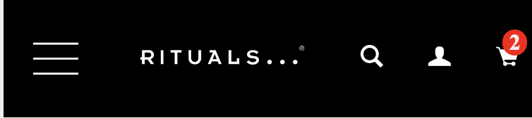

ik heb geleerd hoe ik een hamburgermenu kan maken en hoe ik kan werken met position relative, fixed en absolute.
  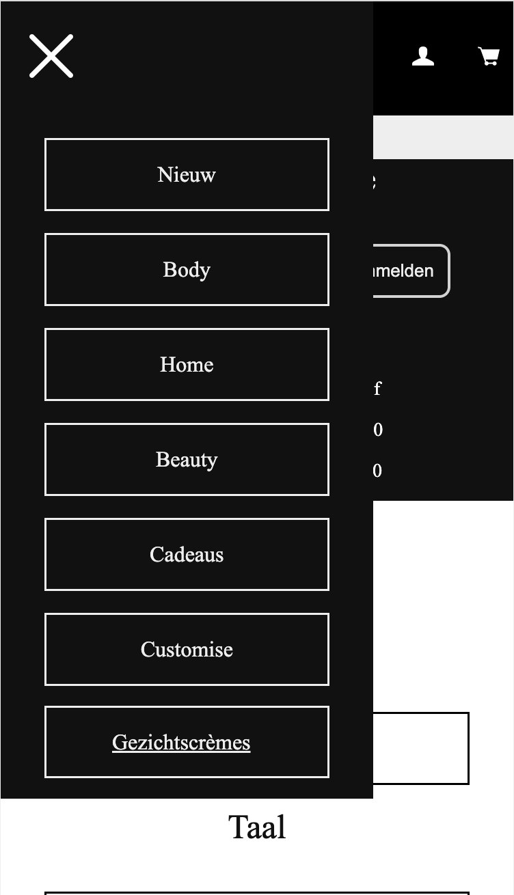

  Ik heb geleerd om animaties te maken met css. En hoe ik een audiobestand kan afspelen op het moment dat er een button of toets is ingedrukt op het toetsenbord. 

Ik heb geleerd om afbeeldingen te vervangen met javascript en de kleuren te veranderen met de root. 
    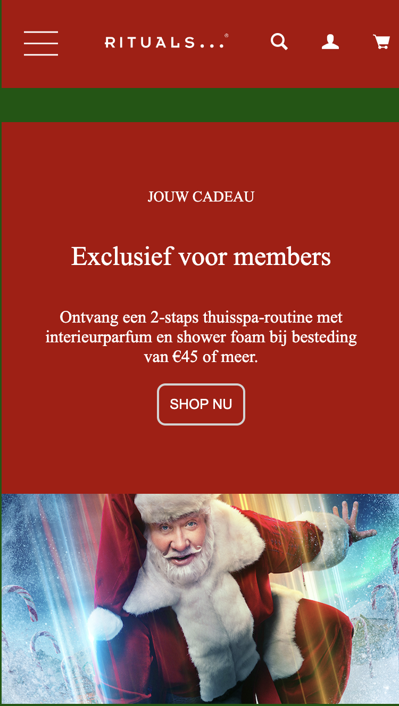

  ### Dit was lastig/Is niet gelukt:
  Korte omschrijving met plaatjes

  Het is niet gelukt om deze horizontale scroll te maken als hoe ik in gedachten had.
  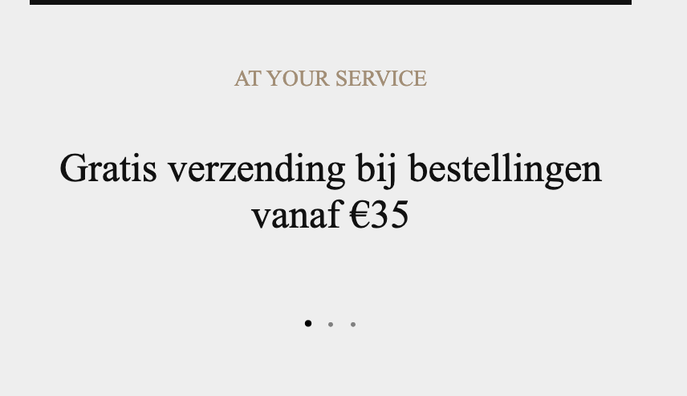

  Ik vond het erg moeilijk om dezelfde stylesheet te gebruiken voor de tweede pagina. Ik heb daardoor ook een paar classes toe moeten voegen. 

het is niet gelukt om deze te laten werken. Ik had dit graag werkend willen maken zodat je een land en taal kan kiezen. 
    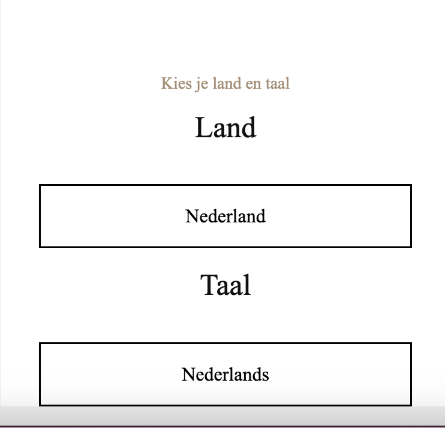

## Bronnenlijst

  
continu bijhouden terwijl je werkt

  Nb. Wees specifiek ('css-tricks' als bron is bijv. niet specifiek genoeg). 
  Nb. ChatGpT en andere AI horen er ook bij.
  Nb. Vermeld de bronnen ook in je code.

  1. bron: https://www.w3schools.com/tags/tag_video.asp 
  2. bron: https://www.w3schools.com/cssref/css3_pr_overflow-y.php
  3. bron: https://www.w3schools.com/tags/tag_label.asp   
  4. loop: icon CORPORATE GOVERNANCE | Qorvo, Inc. (z.d.). Qorvo, Inc. https://ir.qorvo.com/corporate-governance 
  5. Kruisje: icon Wikipedia contributors. (z.d.). File:Cross Icon (white).svg - Wikipedia. https://en.m.wikipedia.org/wiki/File:Cross_icon_%28white%29.svg
  6. hamburgermenu: File:Hamburger Icon White.svg - Wikimedia Commons. (2019, 20 augustus). https://commons.wikimedia.org/wiki/File:Hamburger_icon_white.svg
  7. rituals logo: Home. (2022, 16 augustus). Rituals. https://careers.rituals.com/be/nl/home
  8. mandje: Star Network. (z.d.). White Cart 73 icon - Free White Cart icons. https://www.iconsdb.com/white-icons/cart-73-icon.html 
  9. Profiel: Star Network. (z.d.-b). White User Icon - Free White User icons. https://www.iconsdb.com/white-icons/user-icon.html
  10. bron: https://www.w3schools.com/cssref/css3_pr_overflow-y.php 
  11. bron: https://www.w3schools.com/cssref/css3_pr_animation-keyframes.php
  12. bron: https://mylondonlifestyle.com/2021/11/11/rituals-advent-calendar/
  13. bron: https://voorkeuren.tvgids.nl/consent?target=https%3A%2F%2Fwww.guidinc.nl%2Fnieuws%2Fseries%2Fthe-santa-clauses-disney-plus-kerstmis-kerstserie&aid=bdc&sid=guidinc.web&referrer=https%3A%2F%2Flens.google.com%2F
  14. bron: https://www.w3schools.com/tags/tag_label.asp 
  15. bron: https://www.w3schools.com/css/css3_variables_javascript.asp#:~:text=CSS%20variables%20have%20access%20to,can%20change%20them%20with%20JavaScript
  16. chatgpt
  17. Kenza

